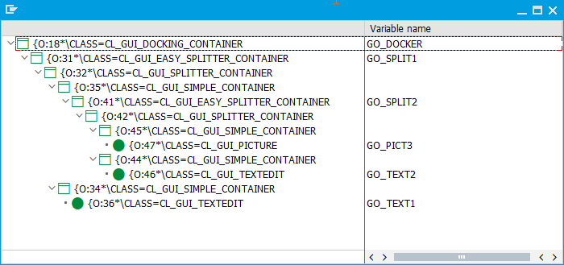

# container_hierarchy

Helper Class for displaying the container hierarchy of given container

# Purpose

Analyzing or documenting container structures. 

# Example

The report ZTRCKTRSR_CONTAINER_TREE_DEMO generates some containers with some controls:

The helper class ZCL_TRCKTRSR_CONTAINER_TREE displays all the containers and controls of the given object GO_DOCKER:

